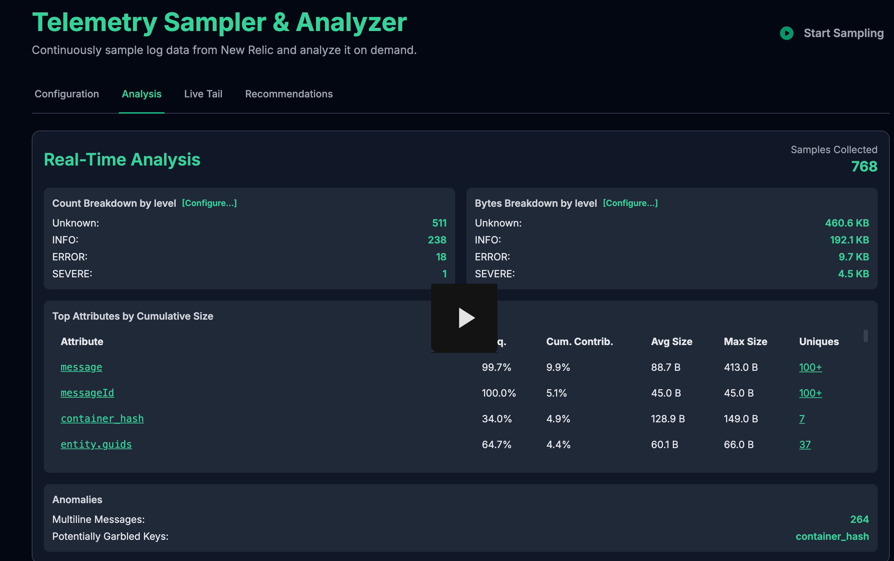
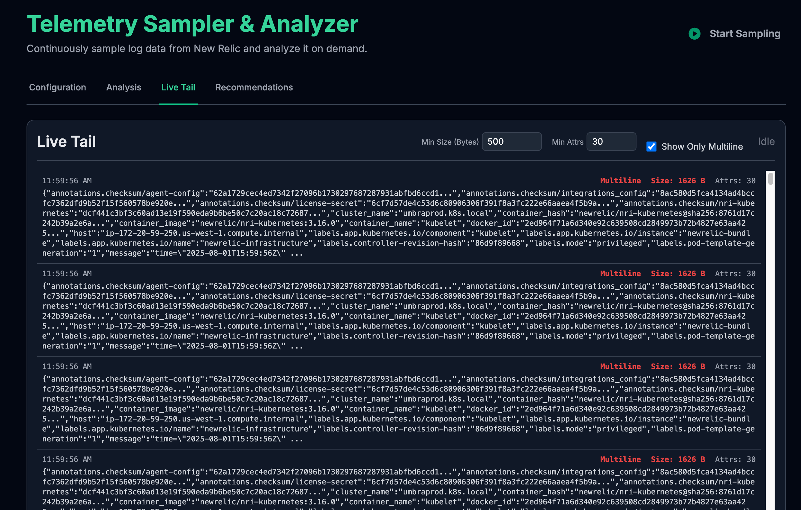
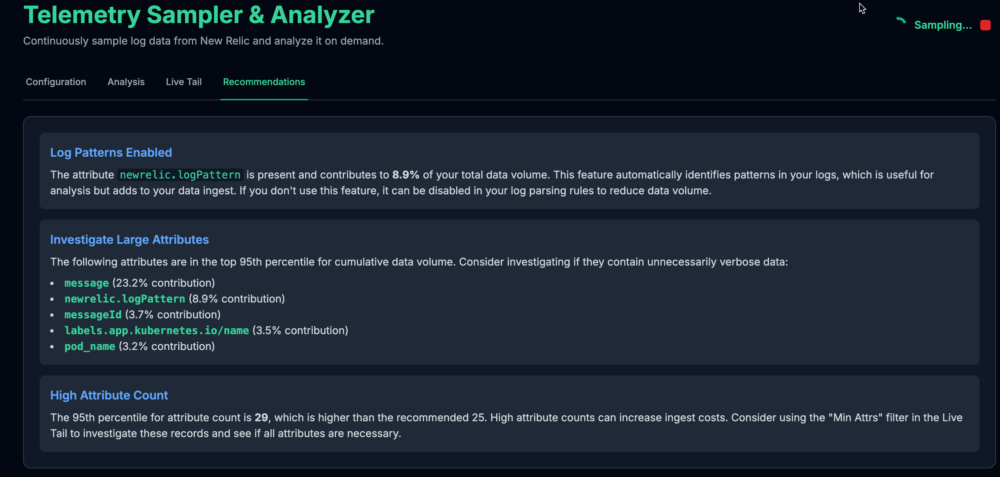
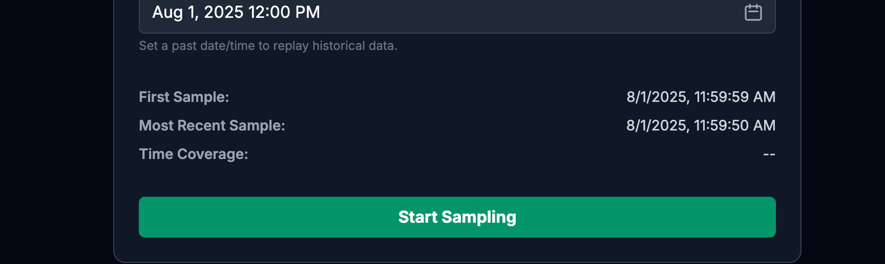
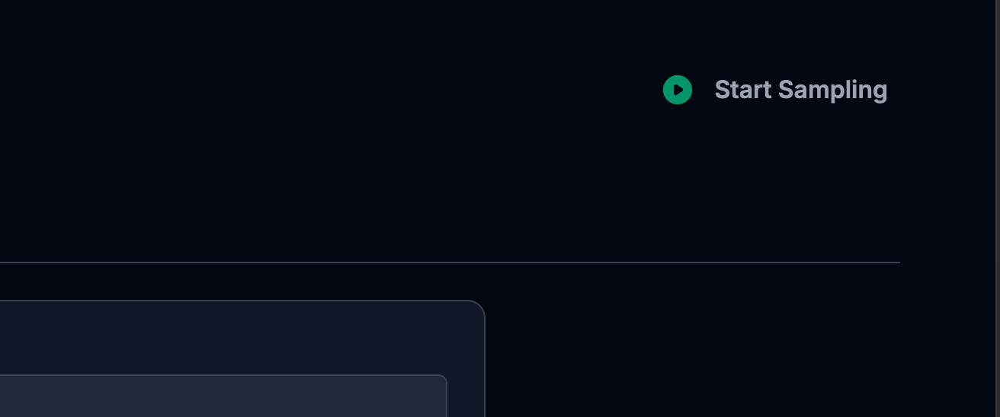

# Telemetry Sampler & Analyzer

## Purpose

### NOTE: A deployed version of this app can be accessed [here](https://nr-telemetry-analyzer.onrender.com/)

This tool allows you to analyze Telemetry data in real time to help find areas for optimization and a variety of other anomalies. This will also work with other telemetry types beyond logs, such as events or traces, as long as the data can be queried via NRQL.

[](https://drive.google.com/file/d/1C-id7wDnMBBkwjDm1UwtGUfWGhKd0RxF/view?usp=sharing)
---

## How to Set Up and Run

This application uses a Python Flask backend to securely handle API requests and an HTML/JavaScript frontend for the user interface.

### Prerequisites

-   Python 3.6+
-   `pip` (Python package installer)

### Server Setup

1.  **Create a Virtual Environment:**
    Open a terminal or command prompt in the project directory and create a virtual environment. This isolates the project's dependencies.
    ```bash
    python -m venv venv
    ```

2.  **Activate the Virtual Environment:**
    -   **On macOS/Linux:**
        ```bash
        source venv/bin/activate
        ```
    -   **On Windows:**
        ```bash
        .\venv\Scripts\activate
        ```
    You'll know it's active when you see `(venv)` at the beginning of your command prompt.

3.  **Install Dependencies:**
    Install the required Python libraries using the provided `requirements.txt` file.
    ```bash
    pip install -r requirements.txt
    ```

---

## Running the Application

1.  **Start the Server:**
    With your virtual environment still active, run the Flask server.
    ```bash
    python log_server.py
    ```
    The server will start and listen for requests on `http://127.0.0.1:5002`.

2.  **Access the UI:**
    Open any modern web browser and navigate to the following address:
    ```
    http://127.0.0.1:5002
    ```
    The server will automatically load the user interface.

---

## How to Use

The application is organized into a series of tabs, each with a specific function.


### Configuration Tab


This is the default view and the control center for your sampling session.

-   **Credentials:** You must provide your **New Relic API Key** and **Account ID**.
-   **Base NRQL Query:** Enter the NRQL query you want to sample from (e.g., `SELECT * FROM Log WHERE service.name = 'my-service'`). The application automatically handles the `SINCE` and `UNTIL` clauses.
-   **Sampling Parameters:**
    -   **Frequency (s):** How often to fetch a new sample of data (default: 30s).
    -   **Window (s):** The duration of each sample (default: 10s). This value cannot be greater than the frequency.
    -   **Limit:** The maximum number of records to fetch per sample.
-   **Arbitrary Start Time:** Optionally, select a past date and time to "replay" historical data. If left blank, sampling begins from the present moment.
-   **Time Stats:** Once sampling begins, this section shows the timestamp of the first and most recent records collected, along with the total time coverage of your sample set.

### Analysis Tab


This tab provides a real-time, high-level overview of the data you've collected. The summary cards and tables will flash green with each new sample.

-   **Breakdown Cards:** By default, these show a breakdown of record counts and total byte size grouped by `level`. You can click **[Configure...]** on either card to group by any other attribute discovered in the data.
-   **Top Attributes Table:** This powerful table shows the top 50 attributes found in your data, sorted by their total contribution to the data volume. It includes:
    -   **Freq.:** The percentage of records that contain this attribute.
    -   **Cum. Contrib.:** The percentage of the total data volume this attribute is responsible for.
    -   **Avg Size & Max Size:** The average and maximum size of the attribute.
    -   **Uniques:** A count of the unique values for that attribute (capped at 100). Clicking the count opens a pop-up with the list of unique values.
-   **Anomalies:** This card highlights potentially problematic data, such as messages that may be improperly formatted multi-line logs.

### Live Tail Tab



This tab provides a raw, real-time view of the last 1000 records collected. Rendering is paused when this tab is not active and refreshes when you return to it.

-   **Record View:** Each record is displayed in a two-row format showing metadata (timestamp, size, attribute count) and a truncated JSON payload.
-   **Interactive Pop-up:** Click on any record to view the full, beautifully formatted JSON payload in a pop-up window.
-   **Live Filters:** You can filter the records shown in the tail in real-time by setting a **Min Size (Bytes)** or a **Min Attrs** count. You can also check **Show Only Multiline** to isolate potentially broken multi-line logs.

### Recommendations Tab

This tab provides a set of dynamically generated recommendations based upon the characteristics of the data sample.



### Starting and Stopping Sampling

Sampling is controlled by the main **"Start Sampling"** button in the Configuration tab, as well as the status indicator in the top-right corner of the application.

-   **To Start:** Click the green "Start Sampling" button or the play icon in the header.
-   **To Stop:** Click the red "Stop Sampling" button or the red square in the header.





